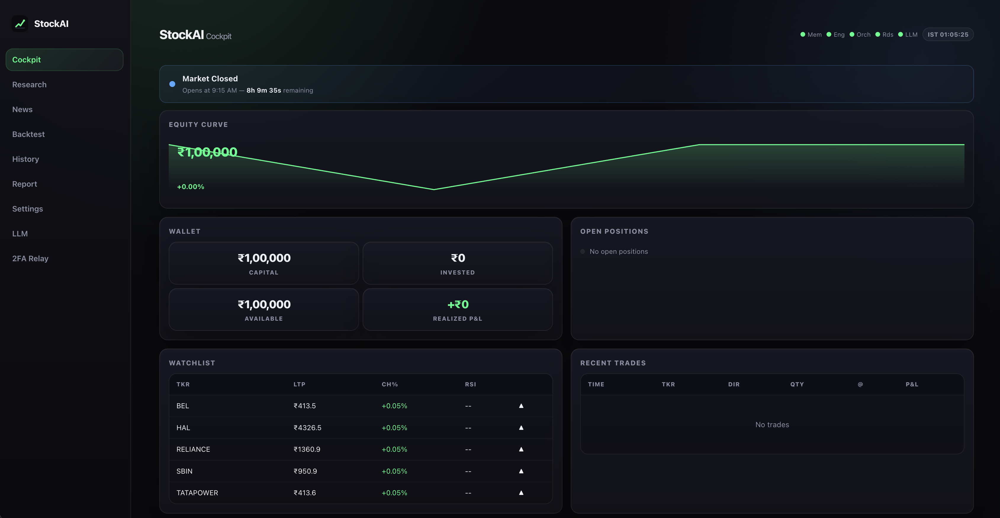
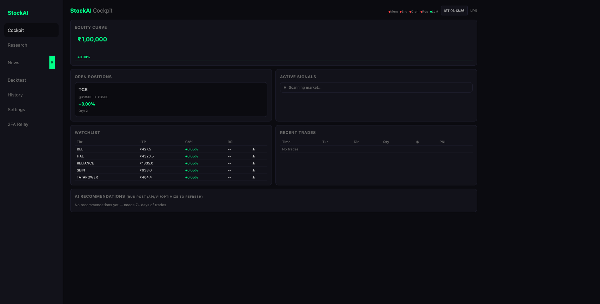
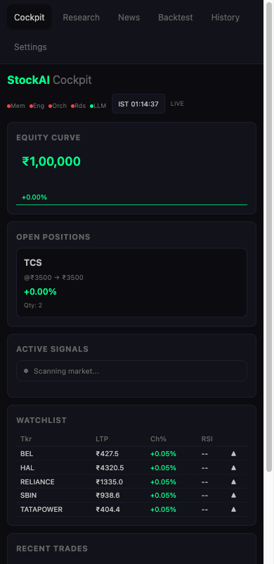
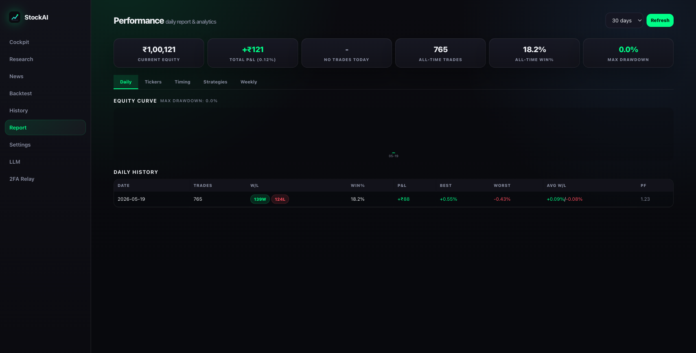
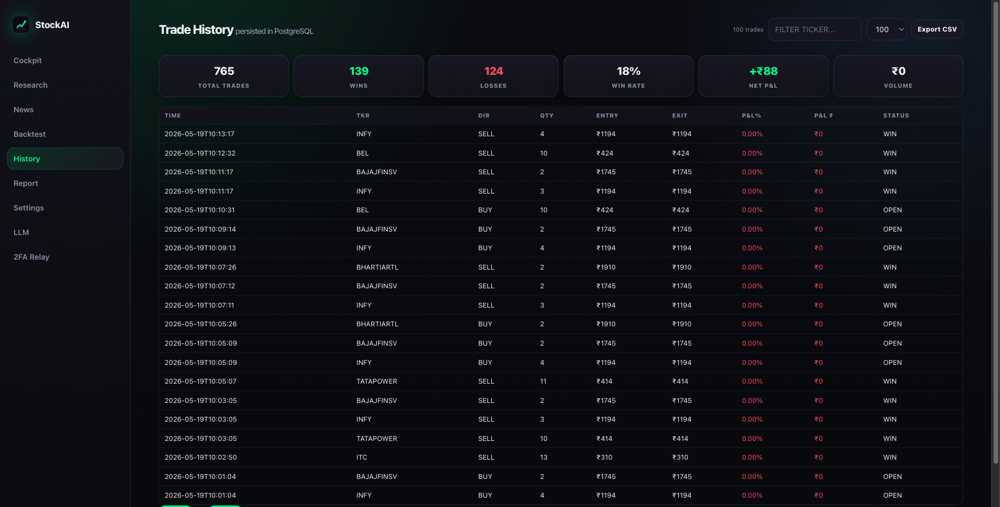
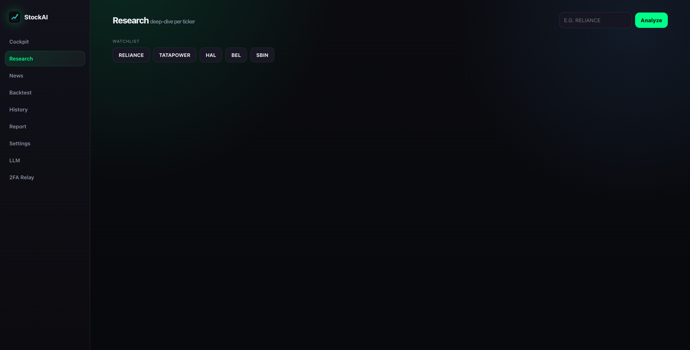
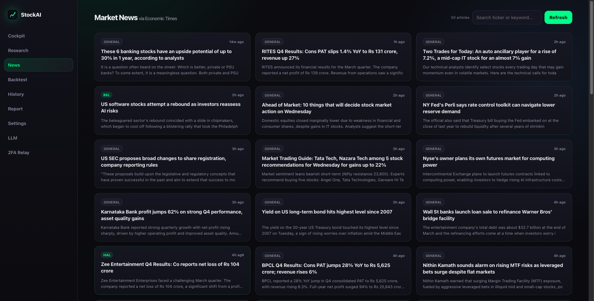
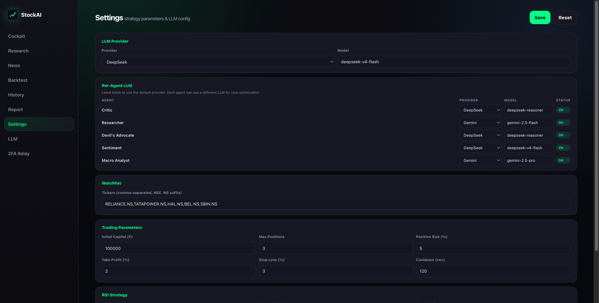
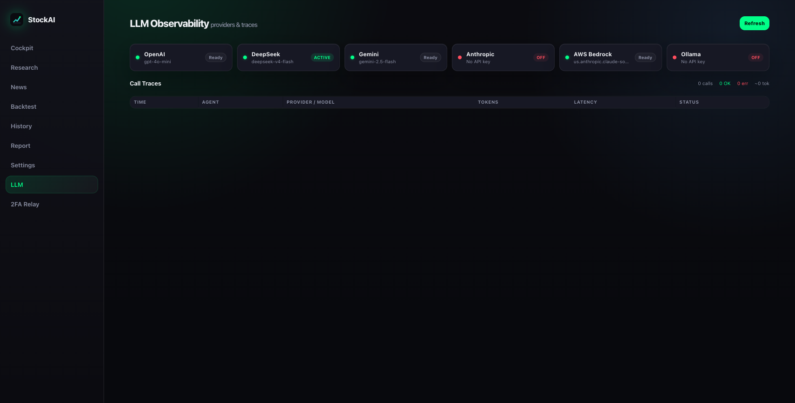
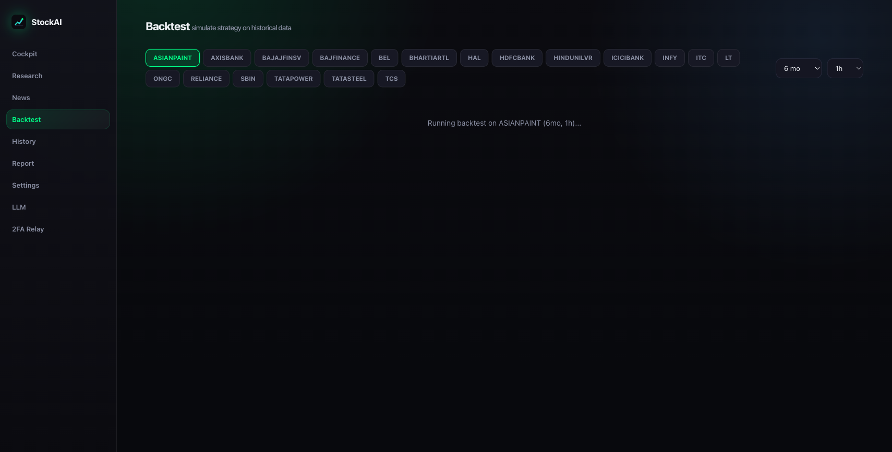

<p align="center">
  
</p>

<h1 align="center">StockAI</h1>

<p align="center">
  <strong>Self-Evolving Algorithmic Trading Agent</strong>
</p>

<p align="center">
  Multi-agent AI trading system for Indian Stock Market (NSE/BSE).<br/>
  Paper trading on AWS · SEBI 2026 compliant · Auto start/stop scheduled
</p>

<p align="center">
  <a href="https://github.com/UmairBaig8/StockAI/blob/main/execution/"></a>
  <a href="https://github.com/UmairBaig8/StockAI/blob/main/cmd/"></a>
  <a href="https://github.com/UmairBaig8/StockAI/blob/main/app/"></a>
  <a href="https://github.com/UmairBaig8/StockAI/blob/main/LICENSE"></a>
  <a href="https://github.com/UmairBaig8/StockAI/blob/main/aws_deploy/"></a>
</p>

<p align="center">
  
</p>

## Quick Start

**Local (macOS, Linux):**
```bash
curl -sSL https://raw.githubusercontent.com/UmairBaig8/StockAI/main/install.sh | bash
```

**AWS EC2 (one command):**
```bash
aws login
bash aws-deploy.sh
```

**Update running instance:**
```bash
bash aws-update.sh
```

## Dashboard

<p align="center">
  
  
</p>

| Page | URL | Description |
|------|-----|-------------|
| **Cockpit** | `/` | Real-time dashboard — equity curve, positions, signals, AI recommendations |
| **Report** | `/report` | Daily analytics — 5 tabs: Daily, Tickers, Timing, Strategies, Weekly |
| **History** | `/history` | Persistent trade history from PostgreSQL — filter, export CSV |
| **Research** | `/research` | LLM research: fundamental/sentiment analysis per ticker |
| **News** | `/news` | Live NSE news feed — Moneycontrol, Economic Times |
| **Backtest** | `/backtest` | Strategy backtesting engine |
| **Settings** | `/settings` | All strategy params hot-reloadable |
| **LLM** | `/llm` | LLM provider health + call traces |

<p align="center">
  
  
</p>

## How It Works

### Trading Strategy

| Feature | Detail |
|---------|--------|
| **Market hours** | 09:15–15:30 IST, Mon–Fri |
| **Auto-discovery** | LLM scans trending NSE tickers at 09:00 IST + hourly |
| **Signal engine** | RSI + MACD + Bollinger Bands every 15s |
| **Volume filter** | Z-score > 1.0 — avoids low-momentum traps |
| **Forced trades** | Every 5 min if no signal (keeps pipeline active) |
| **Position rotation** | Sells weakest holding when full, rotates into best opportunity |
| **Trailing stop-loss** | Dynamic: locks profits at +2%, trails at +5% |
| **Short selling** | Opt-in via settings (BB overbought + volume confirmed) |

### Risk Controls

| Control | Detail |
|---------|--------|
| **Daily loss limit** | 2% of capital — auto-halts |
| **Consecutive loss cooldown** | 3 losses → 10-minute pause |
| **Stop-loss** | 0.5% per trade (configurable) |
| **Orphaned sell rejection** | Engine rejects SELL with no matching position |
| **Suspect trade detection** | Flags entry≈exit trades (<0.1% delta) |

### AI Agents

| Agent | Role | Trigger |
|-------|------|---------|
| **Strategy** | RSI/MACD/BB scanner, auto-discovery, position rotation | Every 15s |
| **Critic** | Postmortems on losses, generates correction rules | Post-trade LOSS |
| **Devil's Advocate** | LLM risk review before each BUY | Pre-execution |
| **Researcher** | Ticker sentiment + trending discovery | On-demand + scheduled |
| **Sentiment** | Fear & Greed Index — blocks BUY if FGI < 30 | Pre-execution |
| **Macro Analyst** | Macro-economic context — blocks BUY if risk=HIGH | Pre-execution |
| **Optimizer** | Weekly AI parameter tuning with Approve/Reject UI | Hourly |

### Self-Evolution Loop

1. Trade executes → result published to Redis
2. Loss → **Critic** analyzes root cause via LLM
3. Generates correction rule (e.g., "Block breakout buys if RSI > 70")
4. Stored in **LanceDB** vector database
5. Next trade → **pre-trade vector lookup** → blocks if similar past failure exists

### SEBI Compliance

| Requirement | Implementation |
|-------------|---------------|
| Daily manual 2FA | Telegram relay + Redis `2fa:active` gate |
| <10 orders/sec | Token bucket rate limiter (10 burst, 1/sec refill) |
| Audit trail | LanceDB `audit_trail` (append-only) + EBS snapshots (30-day retention) |
| Static IP | AWS Elastic IP for broker whitelisting |

## Architecture

```
         ┌──────────────────────────────────────────┐
         │              ORCHESTRATOR (Go)            │
         │   Redis pub/sub · Telegram 2FA · Relay    │
         └──────┬──────────────────────────┬─────────┘
                │                          │
     ┌──────────▼──────────┐    ┌─────────▼──────────┐
     │   ENGINE (Rust)      │    │  MEMORY (Python)   │
     │   <1ms latency       │    │  DeepSeek LLM      │
     │   Market feed (WS)   │    │  LanceDB (vectors) │
     │   2FA gate + rate lim │    │  YFinance (data)   │
     │   Redis persist pos   │    │  Dashboard + UI    │
     └──────────────────────┘    └──────────────────────┘
```

| Layer | Language | Role | Key Tech |
|-------|----------|------|----------|
| Execution | Rust | Orders, 2FA gate, rate limiter, position tracking | Tokio, Axum, Redis |
| Orchestration | Go | Redis pub/sub, Telegram 2FA, scheduler | go-redis, net/http |
| Memory | Python | LLM agents, LanceDB, market data, dashboard | FastAPI, yfinance, LanceDB |
| Storage | PostgreSQL | Trade history, wallet state, positions | asyncpg |
| Vectors | LanceDB | Evolution memory + SEBI audit trail | Embedded |
| Queue | Redis 7 | Trade signals, results, 2FA flag | Docker, Alpine |

## Screenshots

<p align="center">
  
  
</p>

<p align="center">
  
  
</p>

<p align="center">
  
</p>

## AWS Infrastructure

### Auto Start/Stop Schedule

| Event | Time (IST) | Action |
|-------|------------|--------|
| **Start** | 8:30 AM Mon-Fri | EC2 start + Elastic IP associate |
| **Stop** | 3:30 PM Mon-Fri | EBS snapshot → EC2 stop |

### Cost Breakdown

| Item | Monthly |
|------|---------|
| EC2 t3.medium (scheduled) | ~$13 |
| Elastic IP (idle hours) | ~$3.60 |
| EBS snapshots (30 days) | ~$1.50 |
| Lambda + EventBridge | Free |
| LLM (DeepSeek) | $0.50–$3 |
| **Total** | **~$18–$21/mo** |

### Operations

```bash
# Status
bash aws_deploy/scripts/status.sh

# Manual start/stop
aws lambda invoke --function-name stockai-scheduler --cli-binary-format raw-in-base64-out --payload '{"action":"start"}' /dev/stdout
aws lambda invoke --function-name stockai-scheduler --cli-binary-format raw-in-base64-out --payload '{"action":"stop"}' /dev/stdout

# View logs
bash aws_deploy/scripts/logs.sh all

# Reset data (fresh start)
ssh -i stockai-key.pem ec2-user@52.70.58.6 'sudo docker exec stockai-postgres-1 psql -U stockai -d stockai -c "DROP SCHEMA public CASCADE; CREATE SCHEMA public;"'
ssh -i stockai-key.pem ec2-user@52.70.58.6 'sudo docker exec stockai-redis-1 redis-cli FLUSHALL'
ssh -i stockai-key.pem ec2-user@52.70.58.6 'sudo docker exec stockai-memory-1 rm -rf /data/lancedb/*'
```

Full AWS docs: [aws_deploy/README.md](aws_deploy/README.md)

## Project Structure

```
StockAI/
├── app/                         # Python: agents, API, dashboard
│   ├── main.py                  # FastAPI entry, WebSocket, templates
│   ├── strategy.py              # Auto-trading: RSI, MACD, BB, volume
│   ├── critic.py                # Post-mortem LLM analysis
│   ├── researcher.py            # LLM research + ticker discovery
│   ├── devils_advocate.py       # Pre-trade risk review
│   ├── sentiment_agent.py       # Fear & Greed Index
│   ├── macro_analyst.py         # Macro-economic analysis
│   ├── market_data.py           # yfinance → WebSocket bridge
│   ├── news_scraper.py          # RSS: Moneycontrol, NSE announcements
│   ├── vector_store.py          # LanceDB: evolution memory + audit
│   ├── wallet.py                # Portfolio tracking
│   ├── db.py                    # PostgreSQL: trades, wallet
│   ├── router.py                # All API routes
│   ├── config.py                # Pydantic Settings
│   ├── optimizer.py             # AI parameter tuning
│   ├── llm/providers.py         # Multi-provider: DeepSeek, OpenAI, Gemini, Anthropic, Bedrock
│   └── templates/               # Jinja2 dashboard pages
├── execution/                   # Rust: execution engine
│   ├── src/main.rs              # Redis subscriber, 2FA gate, rate limiter
│   ├── src/broker/              # Broker API interface
│   ├── src/engine/              # Order lifecycle, risk checks
│   ├── src/market/              # Market feed processor
│   ├── src/orderbook/           # BTreeMap bid/ask book
│   ├── src/mock/                # Mock broker (paper trading)
│   └── Cargo.toml
├── cmd/                         # Go: orchestrator + relay
│   ├── orchestrator/main.go     # Redis pub/sub, 2FA scheduler
│   └── relay/main.go            # TOTP Telegram relay
├── internal/                    # Go shared libraries
│   ├── broker/                  # Broker API interface
│   ├── handler/                 # TOTP HTTP + Redis 2fa:active
│   ├── scheduler/               # IST-aware task scheduler
│   ├── telegram/                # Telegram Bot API client
│   └── token/                   # TOTP generation/validation
├── aws_deploy/                  # AWS infrastructure
│   ├── README.md                # Full AWS documentation
│   ├── cloudformation/          # Lambda + EventBridge IaC
│   └── scripts/                 # setup, teardown, status, logs, snapshot
├── docker-compose.yml           # 5 services: redis, postgres, memory, orchestrator, engine
├── Makefile                     # Build, run, test commands
├── aws-deploy.sh                # Fresh EC2 deploy
├── aws-update.sh                # Update running instance
├── aws_env.md                   # Quick AWS reference
└── production_ready.md          # Going live checklist
```

## API Endpoints

| Endpoint | Method | Description |
|----------|--------|-------------|
| `/api/v1/health` | GET | Service health |
| `/api/v1/services` | GET | All service statuses |
| `/api/v1/dash` | GET | Dashboard data (trades, portfolio, events) |
| `/api/v1/wallet` | GET | Portfolio snapshot |
| `/api/v1/quote/{ticker}` | GET | Live market quote |
| `/api/v1/settings` | GET/POST | Strategy config (hot-reload) |
| `/api/v1/research` | POST | LLM research for ticker |
| `/api/v1/recommendations` | GET | Pending optimizer suggestions |
| `/api/v1/history` | GET | Trade history (PostgreSQL) + CSV export |
| `/api/v1/llm/traces` | GET | LLM call history |
| `/ws/market` | WebSocket | Real-time NSE quotes |

## Env Variables

See `.env.example` for full list. Key vars:

| Variable | Description |
|----------|-------------|
| `MEMORY_LLM_PROVIDER` | Primary LLM: deepseek, gemini, openai, anthropic, bedrock |
| `MEMORY_DEEPSEEK_API_KEY` | DeepSeek API key |
| `TELEGRAM_BOT_TOKEN` | Telegram bot for 2FA + alerts |
| `TELEGRAM_CHAT_ID` | Your Telegram chat ID |
| `DATABASE_URL` | PostgreSQL connection string |

All strategy params editable at `/settings` — no restart needed.

## Roadmap

See [ROADMAP.md](ROADMAP.md) for planned features.

**Quick Wins (done):** News scraper, Telegram alerts, trailing stop-loss, daily P&L report

**Medium:** PostgreSQL persistence (in progress), multi-timeframe confirmation, MACD + BB, market regime detection

**Big Lifts:** Backtesting engine, real broker integration (Zerodha/Upstox), options flow scanner, AI strategy optimization

## Skills (AI Agent Automation)

This repo includes custom opencode skills for automated development workflows. When working with this project, the AI assistant auto-detects context and loads the right skill.

| Skill | Triggers | What It Does |
|-------|----------|--------------|
| **`aws-ops`** | "deploy", "update aws", "aws start/stop", "fresh start" | EC2 lifecycle, CloudFormation, Git + deploy workflow, data reset |
| **`python-memory`** | "python", "strategy", "critic", "LLM", "lancedb" | FastAPI dev, agent architecture, LLM providers, LanceDB, PostgreSQL |
| **`rust-engine`** | "rust", "engine", "broker", "orderbook", "cargo" | Execution engine, mock broker, fill simulation, Redis integration |
| **`go-orchestrator`** | "go", "orchestrator", "telegram", "2fa", "redis" | Redis pub/sub, Telegram bot, TOTP, scheduler, message handlers |
| **`testing`** | "test", "pytest", "cargo test", "go test", "coverage" | Test generation for all 3 languages, CI/CD, test patterns |

**Examples:**
- Say *"update aws"* → loads `aws-ops` → git commit → push → deploy
- Say *"add RSI test"* → loads `testing` → generates pytest for strategy
- Say *"fix engine bug"* → loads `rust-engine` → cargo test → clippy → rebuild
- Say *"add new agent"* → loads `python-memory` → creates agent file → wires into pipeline

Skills live in `.opencode/skills/` — see [SKILLS.md](SKILLS.md) for the full guide.

## License

MIT
